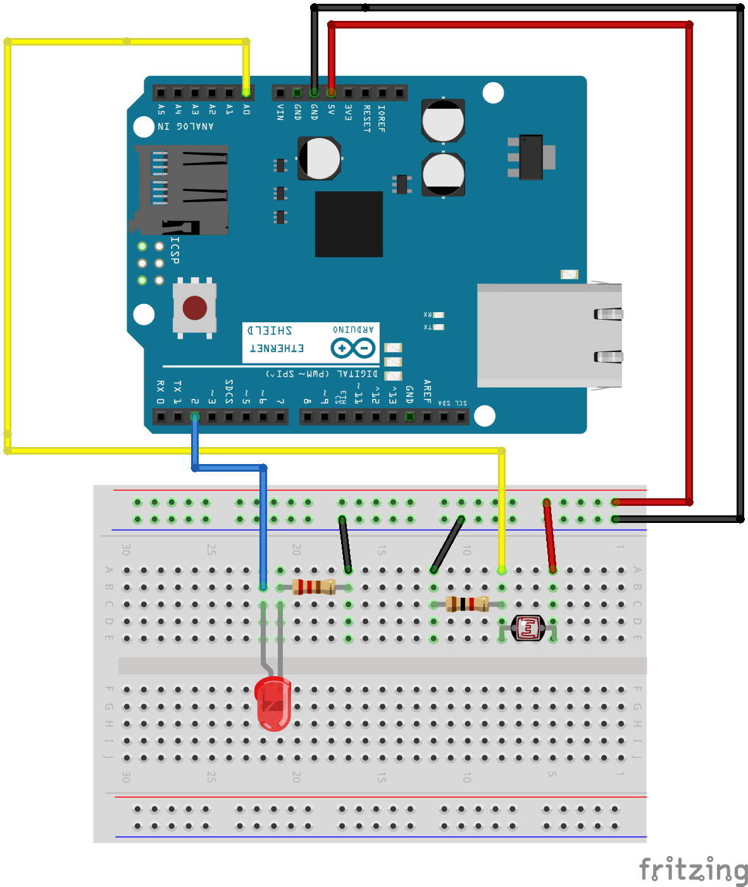

# Example 5

## Overview

Create a nightlight by linking the led output to the value of the
light sensor. Determine a threshold for the light sensor and enble the
LED when the room is dark and disable the LED when the room has
adequate light.

In this example, the code that goes in the loop has been purposly
ommitted. This will provide you with an opportunity to create a custom
solution.

## Hardware Setup



## Software

```c++
#define THRESHOLD 475

int ledPin = 2;
int sensorPin = A0;

void setup() {
  // put your setup code here, to run once:
  Serial.begin(9600); 
  Serial.print("Alive\n");
  pinMode(ledPin, OUTPUT);
}

void loop() {
  // put your main code here, to run repeatedly:
  // Add your code to create a night light here. 

}
```

## Output 


## Exploration 

* The example program prints "NIGHT" or "DAY" repeatedly. How would you change the program to only print the "NIGHT" or "DAY" one time for each transition? 
