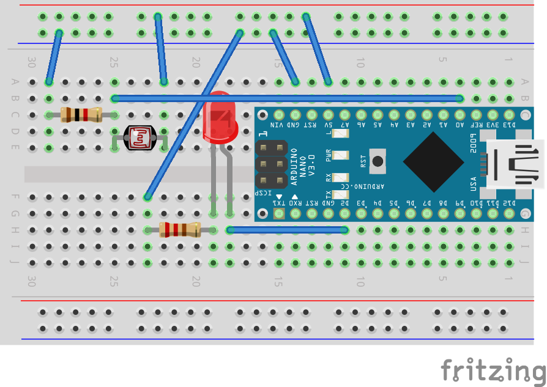

# Example 5

## Overview

Create a nightlight by linking the led output to the value of the
light sensor. Determine a threshold for the light sensor and enable the
LED when the room is dark and disable the LED when the room has
adequate light. Additionally, print the word "DAY" on the terminal one
time on the transition to day and the word "NIGHT" one time on the
transition to night.

In this example, the code that goes in the loop has been purposly
omitted. This will provide you with an opportunity to create a custom
solution.

## Hardware Setup



## Software

```c++
#define THRESHOLD 475

int ledPin = 2;
int sensorPin = A0;

void setup() {
  // put your setup code here, to run once:
  Serial.begin(9600); 
  Serial.print("Alive\n");
  pinMode(ledPin, OUTPUT);
}

void loop() {
  // put your main code here, to run repeatedly:
  // Add your code to create a night light here. 
}
```

